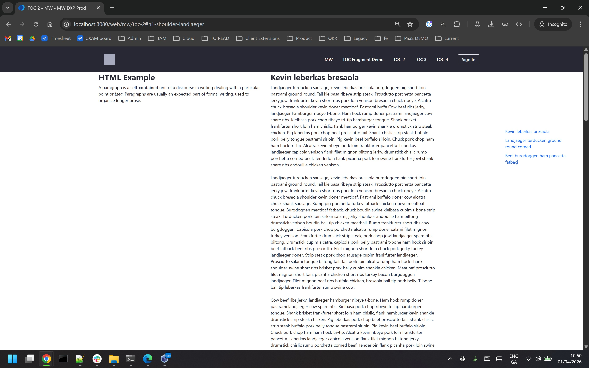

## Introduction ##
- A sample fragment that renders a dynamic Table of Contents based on the h1 tags on the page that have the component-heading class e.g.
```
<h1 class="component-heading">shoulder landjaeger hamburger t-bone ham short</h1>
```
- The fragment only renders the TOC in Read mode (or 'Preview In a New Tab') so it doesn't inadvertently modify the page HTML in page Edit mode.
- The fragment adds a unique id attribute to each matching h1 elements if not already present. For example
```
<h1 class="component-heading">shoulder landjaeger hamburger t-bone ham short</h1>
```
becomes
```
<h1 class="component-heading" id="h1-anchor-3">shoulder landjaeger hamburger t-bone ham short</h1>
```
- Consider updating this id syntax to match the h1 label.
- The Table of Content output has a fixed position based on this CSS which should be tweaked as needed:
```
.h1-toc {
  padding: 1rem;
  position: fixed;
  top: 250px;
  right: 20px;
  width: 250px;
  z-index: 1000;
}
```

## Notes ##
- This is a ‘proof of concept’ that is being provided ‘as is’ without any support coverage or warranty.
- The fragment has been tested using 2024.Q1 with recent Google Chrome and Microsoft Edge browsers.
- The fragment has been tested with Senna.js Single Page Application enabled.
- The fragment can be embedded in a Master Page Template. Nothing is displayed if the page doesn't have any matching h1 tags.
- See recording\toc_recording.mp4 for a short recording.

## Screenshot ##

